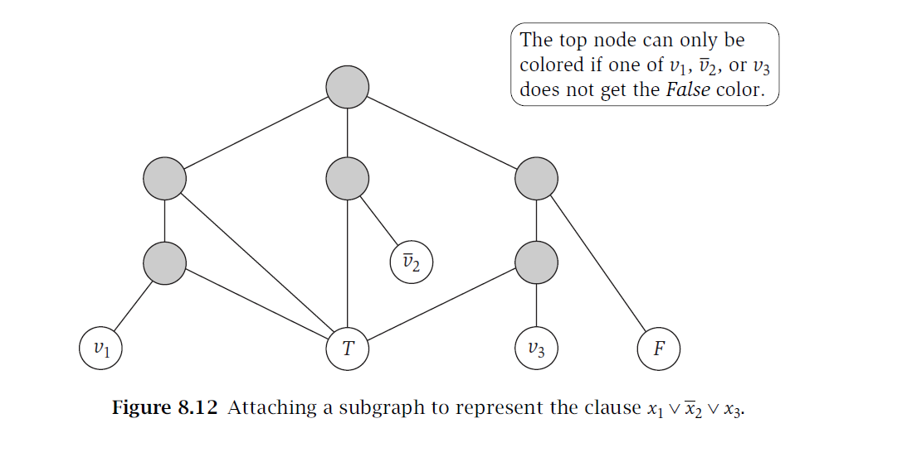

# Problemas NP, NP-Completo, NP-Hard
Asumiendo que los siguientes problemas ya se han demostrado como NP-Completos:

- SAT
- 3-Sat
- Clique
- Conjunto independiente
- Vertex Cover
- Subset Sum
- Mochila
- Hamilton (Dirigido)
- Viajante

Demuestre que los siguientes problemas son NP-Hard o NP-Completos, según corresponda.

## Set cover
> Dado un conjunto $X$ y una colección S de subconjuntos de $X$, el problema consiste en determinar si existe un subcolector $S' \subseteq S$ tal que cada elemento de $X$ aparezca exactamente una vez en los subconjuntos de $S'$.

NP- HARD:

número cromático es 3 <= set cover(exact cover):

## Clique máximo
> Un clique es un subgrafo completo dentro de un grafo. Formalmente, un clique en un grafo $G=(V,E)$ es un subconjunto de vértices $C \subseteq V$, tal que todos los pares de vértices en $C$ están conectados directamente por una arista. En otras palabras, todos los vértices del clique están mutuamente conectados.

## Hallar el clique de mayor tamaño en un grafo.

Demostración de que clique es NP-Hard:
clique <= clique máximo
Si tengo el clique de mayor tamaño del grafo, entonces puedo saber en tiempo polinomial cuál es ese tamaño, al que llamaremos h. Si h es mayor o igual que k, entonces escogemos un subconjunto de vértices del clique(de tamaño k) y tenemos un clique de ese tamaño. Si h < k,entonces no existe un clique de tamaño k porque de existir ese sería el mayor clique, contradicción.

Por qué no puedo decir que es NP?
Por ser un problema de optimización.

## Cobertura de Clique
> Dado un grafo $G=(V,E)$, una cobertura de cliques es un conjunto de cliques ${C_1,C_2,…,C_k}$ tal que cada vértice $v \in V$ pertenece a al menos uno de estos cliques.

El objetivo del problema de cobertura de cliques es encontrar el número mínimo de cliques necesarios para cubrir todos los vértices del grafo.

NP- Hard:
número cromático <= cobertura de cliques
Sea G = (V,E) y G' su grafo complemento y sea k el número cromático de G; el número mínimo de cliques necesarios para cubrir todos los vértices del grafo G' que es k. En una k-coloración de de G los vértices de un mismo color no tienen ninguna arista entre sí, por lo que en G' formarán un clique. Luego en G' hay k cliques ${C_1,C_2,…,C_k}$ que cumplen que cada vértice $v' \in V'$ pertenece a al menos uno de estos cliques. Si en G' existiera un clique cover de tamaño h menor que k, cada uno de estos cliques formaría un conjunto independiente en G, por lo que coloreando del mismo color los vértices que pertenecen al mismo conjunto independiente se llega a una coloración válida con h colores, por lo que el número cromático de G no sería k, contradicción. Por lo tanto, el menor clique cover de G' es de tamaño k. 

## Numero Cromático
> El número cromático de un grafo es el número mínimo de colores necesarios para colorear los vértices del grafo de manera que dos vértices adyacentes no compartan el mismo color.

## Hallar el número cromático en un grafo.

NP-hard:
3-SAT <= número cromático
Sean x1, . . . , xn las variables de una instancia de 3-SAT y C1, . . . , Ck sus cláusulas, vamos a construir un grafo G = (V,E) que cumpla que es 3-coloreable si y solo si la instancia de 3-SAT es satisfacible. Para ello a partir de un grafo vacío le añadiremos 3 nodos con aristas entre ellos formando un triángulo, lo que garantiza que cuando se vayan a colorear cada uno reciba un color distinto. Llamaremos a estos nodos True, False y Base y nos referiremos al color que se le asocie a cada uno de la misma manera, por lo que si a un nodo del grafo le corresponde el mismo color que el nodo True, decimos que ese nodo tiene color True. Ahora, por cada variable xi con $i \in [1,n]$ se crean los nodos vi y !vi y se forma un triángulo con ellos y el nodo Base. De esta manera se garantiza que al colorear los nodos correspondientes a una variable no se le pueda asociar el color Base, pero sí True o False y que una variable y su negación nunca tengan el mismo color. Hasta este punto el grafo siempre será 3-coloreable, por lo que necesitamos añadir algo que represente a cada cláusula del 3-SAT y que fuerce al grafo a necesitar más de 3 colores para colorearse en caso de que alguna cláusula no se pueda satisfacer. 

El grafo representado en la figura anterior garantiza que el nodo superior (nodo A) no podrá ser coloreado con ninguno de los colores Base, True o False en caso de que todos los nodos que correspondan a las variables(v1, !v2, v3) estén coloreados con False. Por lo tanto, en caso de que a todas las variables se les asigne False, el grafo no será 3-coloreable. En cualquier otro caso, el grafo de la figura anterior es 3 coloreable. Luego podemos decir que por cada cláusula Ci se crea un grafo como el de la figura anterior con las variables correspondientes a la cláusula. De esta manera se obtiene como grafo final uno que garantiza que una variable y su negación no reciban el mismo color y que para ser 3-coloreable requiere que en cada cláusula al menos a una variable se le asigne el color True.

Por lo tanto, para saber si la instancia de 3-SAT es satisfacible se puede crear el garfo G y hallar su número cromático. Si este es 3 entonces asignándole el valor true a las variables que corresponden a los nodos que tienen el color True se obtiene una asignación que garantiza que por cada cláusula haya al menos una variable true, lo que hace que la FNC de true. Por otra parte, si tenemos una asignación que satisface la FNC entonces coloreando los nodos que corresponden a cada variable con su valor de verdad se encuentra una manera de colorear el grafo con 3 colores porque por la manera en que construimos el grafo la  
Explicar tiempo polinomial??

Es polinomial porque a la hora de crear el grafo, por cada cláusula se va a crear el subgrafo en tiempo constante... Explicar mejor... :)

## Conjunto Dominante
> En un grafo $G=(V,E)$, un conjunto de vértices $D \subseteq V$ es un conjunto dominante si cada vértice de $V$ que no está en $D$ es adyacente a al menos un vértice en $D$.

> Una partición de los vértices $V$ en $k$ conjuntos $D_1,D_2,…,D_k$​ es una partición domática si cada $D_i$​ (para $i=1,2,…,k$) es un conjunto dominante. El numero dominante es la cardinalidad del menor conjunto dominante de $G$.

## Hallar el numero dominante de $G$.

## Número Domatic
> El número de domatic de un grafo $G$, denotado como $domatic(G)$, es el número máximo $k$ tal que los vértices de $G$ pueden dividirse en $k$ conjuntos disjuntos $D_1,D_2,…,D_k$ donde cada $D_i$​ es dominante.

## Hallar el número de Domatic de un grafo.

## Ancho de Banda
> Dado un grafo $G=(V,E)$ y una disposición lineal de sus vértices representada como una función $f:V→{1,2,…,|V|}$, el ancho de banda de $G$ para esa disposición es:

$$max⁡{|f(u)-f(v)| : (u,v) \in E}$$

El problema consiste en encontrar una disposición $f$ que minimice este valor, es decir, reducir al mínimo la distancia máxima en la disposición lineal entre los extremos de las aristas del grafo.

## Retroalimentación de Vértices
> Dado un grafo $G=(V,E)$, un conjunto de retroalimentación de vértices es un subconjunto de vértices $F \subseteq V$ tal que al eliminar todos los vértices en $F$ (y sus aristas incidentes), el grafo resultante no contiene ciclos (es un grafo acíclico o un bosque, si es no dirigido).

El objetivo del problema es encontrar el conjunto de retroalimentación de vértices de tamaño mínimo.

NP- Hard:

vertex cover <= retroalimentación de vértices:

Sea $G=(V,E)$ un grafo, crearemos un grafo G' dirigido tal que para todo $v \in V$ se añaden 2 nodos: v0 y v1 con un arco de v0 a v1. Luego por cada arista $<u,v> \in E$ vamos a añadir en G' un arco de u1 a v0 y de v1 a u0. De esta manera cada arista en G va a estar representada en el grafo G' por un ciclo que solo contiene a los 4 vértices que corresponden a los vértices que toca esa arista en G. 
tamaño del min vertex cover = k
tamaño del min conjunto de retroalimentación de vértices = h
Sup k < h:
Tenemos un conjunto de vértices {v1,v2,..., vk} que tocan a todas las aristas del grafo G; al eliminar en el grafo G' a vi0 para todo $i \in [1,k]$ deben quedar ciclos porque de lo contrario tendríamos un conjunto de retroalimentación de vértices menor que el mínimo. Ahora bien, por la manera en la que construimos el grafo G' todos los arcos van de un nodo con índice 0 a uno con índice 1, por lo tanto sin pérdida de generalidad podemos decir que el ciclo empieza en el nodo x0. Luego el ciclo tendría la forma <x0,x1,wo,...,x0> porque de x0 el único arco que sale va hacia x1. Pero de x1 solo se crea un arco hacia w0 si en G existía una arista entre los vértices x y w por lo tanto, x o w deben pertenecer al vertex cover de G, por lo que al eliminar los nodos con índice 0 correspondientes a los vértices del vertex cover el ciclo deja de existir. Por lo tanto no quedarían ciclos en G' después de eliminar k nodos, luego existe un conjunto de retroalimentación de vértices de tamaño k que es menor que el mínimo, contradicción.
Por esto k >= h

k <= h:
Si enemos en G' un conjunto de retroalimentaciónde vértices S' de tamaño h . Entonces tomando los vértices que corresponden a los nodos de S' en G tenemos el conjunto S de tamaño h. Si existe alguna arista <x,v> en G tal que ni x ni v pertenecen a S, entonces en G' quedarían los 4 nodos correspondientes a estos vértices después de eliminar los que pertenecen al conjunto de retroalimentación, por lo que quedaría el ciclo formado por ellos. Luego S'no sería un conjunto de retroalimentación de vértices, por lo tanto, el conjunto S es un vertex cover de tamaño h, de ahí que k <=h.

Como k >= h y  k <= h entonces k = h.

Luego, al obtener el tamaño del menor conjunto de retroalimentación de G'tenemos el tamaño del menor vertex cover en G. Por lo tanto, para saber si el grafo G tiene vertex cover de tamaño k obtenemos el tamaño del menor conjunto de retroalimentación, si es menor o igual que k entonces se devuelve True, en caso contrario se devuelve False.

## Retroalimentación de Arcos
Dado un grafo $G=(V,E)$, un conjunto de retroalimentación de arcos es un subconjunto de arcos $F \subseteq E$ tal que al eliminar todos los arcos en $F$, el grafo resultante no contiene ciclos (es un grafo acíclico o un bosque, si es no dirigido).

El objetivo del problema es encontrar el conjunto de retroalimentación de arcos de tamaño mínimo.

NP-Hard:
vertex cover <= retroalimentación de arcos

La entrada del problema de Cobertura de Vértices es un grafo no dirigido \( G = (V, E) \). Dado \( G = (V, E) \), creamos un grafo dirigido \( G' = (V', E') \) tal que por cada vértice v que pertenece a V, v y v' pertenecen a V' y E'= {(𝑣,𝑣′),(𝑣′,𝑢),(𝑢′,𝑣)∣⟨𝑢,𝑣⟩∈𝐸}. 

## Correctitud
Existe una cobertura de vértices en \( G \) de tamaño \( k \) si y solo si existe un conjunto de retroalimentación de arcos en \( G' \) de tamaño \( k \).

### Demostración
(⇐)Sea \( S' \) un conjunto de retroalimentación de arcos de \( G' \) de tamaño \( k \). Si existe 𝑒∈𝑆' tal que \( e \) no es una arista \( (v', v) \), entonces \( e \) es una arista de la forma \( (v', u) \). Si \( e \) es una arista \( (v', u) \), como 𝑒∈𝑆', abarca todos los ciclos \( [v', u, ..., v'] \). Todos los caminos de u a v' pasan por \( v \), ya que el único arco incidente en \( v' \) es \( v \). Por tanto, si sustituimos \( (v', u) \) por \( (v, v') \), se abarcan los mismos ciclos de \( G' \). Por tanto, es posible crear un nuevo conjunto \( S' \) de tamaño \( k \) formado solamente por arcos de la forma \( (v, v') \). Dado el nuevo conjunto \( S' \), como \( S' \) abarca todos los ciclos, también abarca los ciclos \( c \) de la forma \( c = [v, v', u, u', v] \) en \( G' \). A cada ciclo \( c \) en \( G' \) se le asocia una arista ⟨𝑢,𝑣⟩∈𝐸 y viceversa. Como por cada ciclo \( c \) se cumple que (𝑣,𝑣′)∈𝑆′ y (𝑢,𝑢′)∈𝑆', entonces es posible crear un conjunto \( S \) formado por los vértices de \( V \) correspondientes a las aristas de \( S' \), el cual abarca todas las aristas de \( G \). Por tanto, \( S \) es una cobertura de vértices de \( G \).

(⇒) Sea \( S \) una cobertura de vértices de \( G \), entonces para todo ⟨𝑢,𝑣⟩∈𝐸 se cumple que u∈𝑆 o v∈𝑆. Sea \( S' \) un conjunto de arcos formado por los arcos \( (v', v) \) correspondientes a los vértices \( v \) que pertenecen a \( S \). Demostremos que \( G' - S' \) no tiene ciclos. Dado un ciclo \( c \) de \( G' \); si v'∈ c, entonces <v,v'> ∈c, ya que en \( v' \) solo incide \( v \); si v∈c, entonces <v,v'>∈c, ya que \( v \) solo incide en \( v' \). Por tanto, en cada ciclo de \( G' \) existe un arco de la forma \( (v, v') \), por lo que \( S' \) es una retroalimentación de vértices de \( G' \).

Luego para saber si existe un vertex cover de tamaño k en G, realizo la transformación y si el conjunto de retroalimentación de arcos de tamaño mínimo de G' es de tamaño h > k retorno False, porque de existir un vertex cover de tamaño k en G también habría un conjunto de retroalimentación de arcos de tamaño k en G', lo cual no pasa porque h es el mínimo. En otro caso retorno True.

## 3D Matching
> El problema se basa en encontrar un emparejamiento dentro de un conjunto tridimensional.

Supongamos que tienes tres conjuntos disjuntos: $X$, $Y$, y $Z$, cada uno de tamaño $n$. También tienes un conjunto $T$ de ternas de la forma $(x,y,z)$, donde $x \in X$, $y \in Y$, y $z \in Z$.

El objetivo es determinar si existe un subconjunto de $T$ de tamaño $n$ (es decir, nn ternas) tal que cada elemento de $X$, $Y$, y $Z$ aparezca exactamente una vez en las ternas seleccionadas.

## Dimensión Bipartita
> Para un grafo $G=(V,E)$, la dimensión bipartita $b(G)$ es el menor entero $k$ tal que las aristas de $G$ pueden particionarse en k conjuntos $E1,E2,…,Ek$ donde cada subgrafo $Gi=(V,Ei)$ es bipartito.
 
> Determinar la dimensión bipartita de un grafo cualquiera.

## Numero de Intersección
Sea $G=(V,E)$ un grafo no dirigido con $V$ como el conjunto de vértices y $E$ como el conjunto de aristas. El número de intersección de $G$, denotado como $int(G)$, es el mínimo entre las cardinalidades de una colección de conjuntos ${S_v​:v \in V}$, tal que:

A cada vértice $v \in V$ se le asigna un conjunto $S_v$​.
Existe una arista $(u,v) \in E$ si y solo si $S_u \cap S_v \neq \emptyset$.
En otras palabras, el número de intersección mide cuántos conjuntos son necesarios para representar todas las relaciones (aristas) entre los vértices mediante intersecciones de conjuntos.

Subgrafo Máximo Bipartito
El problema consiste en encontrar dado un grafo $G=(V,E)$ el subgrafo $G'=(V',E')$ con $V' \subseteq V$ y $E' \subseteq E$ de forma que $G'$ sea bipartito y $|E'|$ es máximo.

Máximo Corte
Sea $G=(V,E)$ un grafo con aristas ponderadas. Un corte es una division de los vertices en dos conjuntos $T$ y $V-T$. El costo de un corte es la suma de los pesos de las aristas que van de $T$ a $V-T$. El problema trata de encontrar el corte de mayor costo de un grafo.